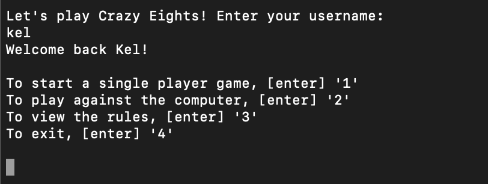
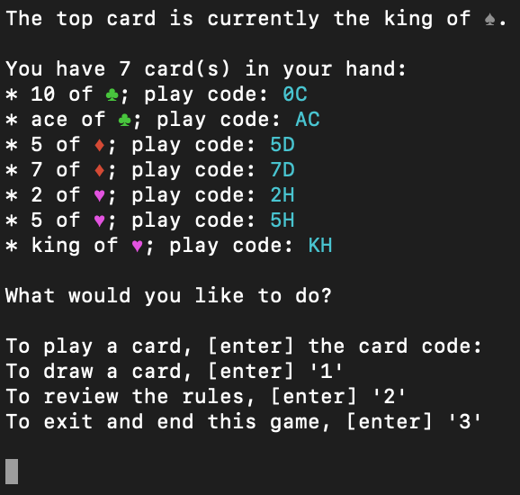
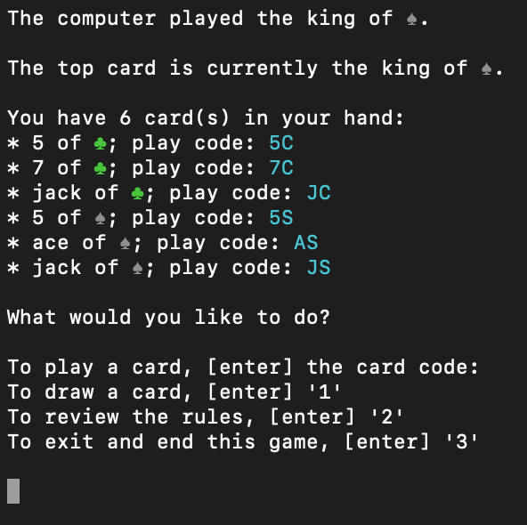

Crazy Eights!
==============

Welcome to Crazy Eights, a simple command line application that let's you play this tried and true card game.

## Running the game

Run this program with Ruby 2.4.1 or higher. Once cloned onto your computer, start by running `bundle install` .

To run the game, enter into your terminal `ruby bin/run.rb` . You will be greated with the welcome page:

From here, choose which game version you would like to play, and have fun!

## Rules

Game rules can be viewed anytime within the game as well, so don't worry if you forget.

### Game Play Baseline

Each turn ends when you play a card, and the game ends when someone successfully plays all of the cards in their hand. You can only play a card if **either** its suit or number matches the last played card. There is one exception - **Eights are wild!**. An Eight can be played any time, and when you play it you will be able to change the suit in play.

### For single player
 
You're playing against the deck - **to win** you need to get rid of all the cards in you hand before you run out of cards to draw from the deck.

### For playing against the computer

After you complete each turn, the computer will play a card. **You win** if you play all of your cards before the computer plays all of its cards. **You lose** if the computer plays all of its cards first, _or_ if you run out of cards to draw from the deck.

